# Red Button Machine

<!--
See notes in src/red-button-machine.mmd source file for diagram.svg.
-->



## Development

Use Node Express server to serve the files and see example use case.

```bash
npm install;
npm start;
```

Run the unit tests with Mocha and Puppeteer.

```bash
npm test;
```
